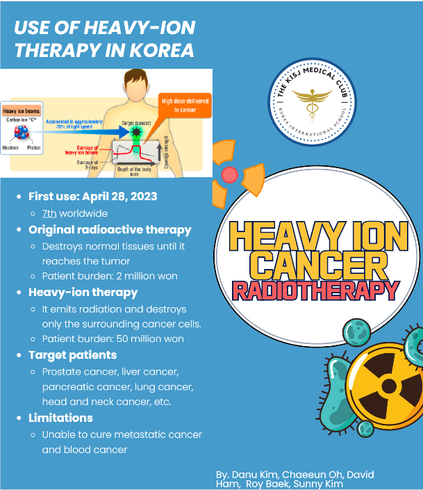
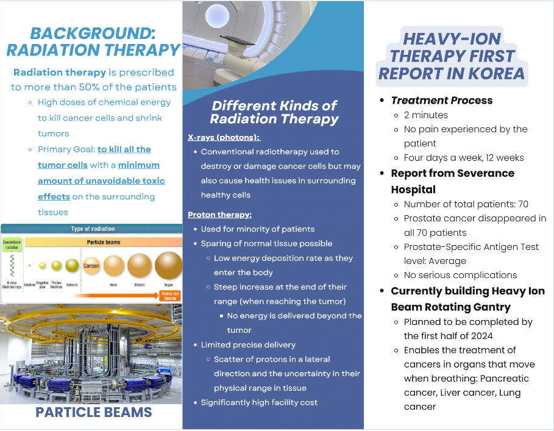

# KIS Medical Club Brochure

A bilingual medical education brochure developed by members of the Korea International School Medical Club, featuring practical emergency-response guidance and an introduction to modern medical technology breakthroughs such as heavy-ion cancer radiotherapy.

The complete brochure can be viewed or downloaded as a PDF file.
📄 [Medical Club Brochure.pdf](Medical%20Club%20Brochure.pdf)

## Overview

This project presents a student-created medical brochure designed to make health and emergency-response information more accessible to students and community members. The brochure combines concise explanations, visual guides, and bilingual English/Korean content to help readers understand common medical emergencies and recent developments in healthcare.

The brochure covers emergency topics such as choking and burns, as well as a technology-focused section on heavy-ion cancer radiotherapy in Korea.

The figures show the brochure’s heavy-ion cancer radiotherapy section, including background information, treatment comparisons, and the use of heavy-ion therapy in Korea.

<p align="center">
  
  
</p>

## Topics Covered

### Choking and Airway Obstruction

The choking section explains how airway obstruction can occur, common warning signs, prevention methods, and emergency response procedures. It introduces symptoms such as difficulty breathing, weak or ineffective coughing, bluish skin color, and loss of consciousness. It also outlines response steps such as calling emergency services, encouraging coughing, giving back blows, and performing abdominal thrusts when appropriate.

### Burns and Burn First Aid

The burns section explains causes, identification, and first-aid responses for minor and major burns. It includes guidance on cooling the injured area, covering the burn with sterile material, avoiding harmful actions such as bursting blisters, and seeking emergency care for severe burns.

### Heavy-Ion Cancer Radiotherapy

The heavy-ion therapy section introduces radiation therapy and compares conventional X-ray therapy, proton therapy, and heavy-ion therapy. It discusses the use of heavy-ion cancer radiotherapy in Korea, its target patient groups, treatment process, benefits, limitations, and cost-related considerations.

## Key Features

- Bilingual educational content in English and Korean
- Student-developed public health communication project
- Emergency-response guidance for choking and burns
- Visual first-aid explanations and brochure-style design
- Introduction to heavy-ion cancer radiotherapy and its use in Korea
- Designed for school and community health education

## Repository Contents

```text
.
├── assets/
│   ├── Heavy_ion_cancer_radiotherapy1.PNG
│   └── Heavy_ion_cancer_radiotherapy2.PNG
├── Medical Club Brochure.pdf
└── README.md
```
## Purpose

The purpose of this project is to promote medical awareness and preparedness among students and community members. By presenting emergency procedures and medical innovations in an accessible brochure format, the project encourages readers to become more informed about first aid, safety, and healthcare technology.

## Contributors

Created by members of the Korea International School Medical Club.

## Disclaimer

This brochure is intended for educational purposes only. It is not a substitute for professional medical advice, diagnosis, treatment, or certified first-aid training. In a real emergency, contact local emergency services immediately.
